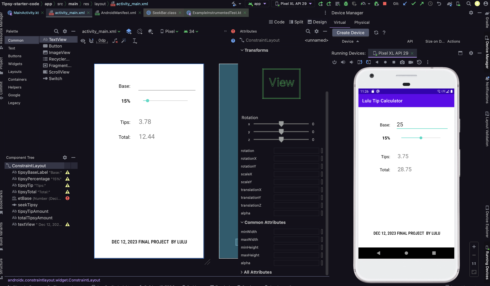
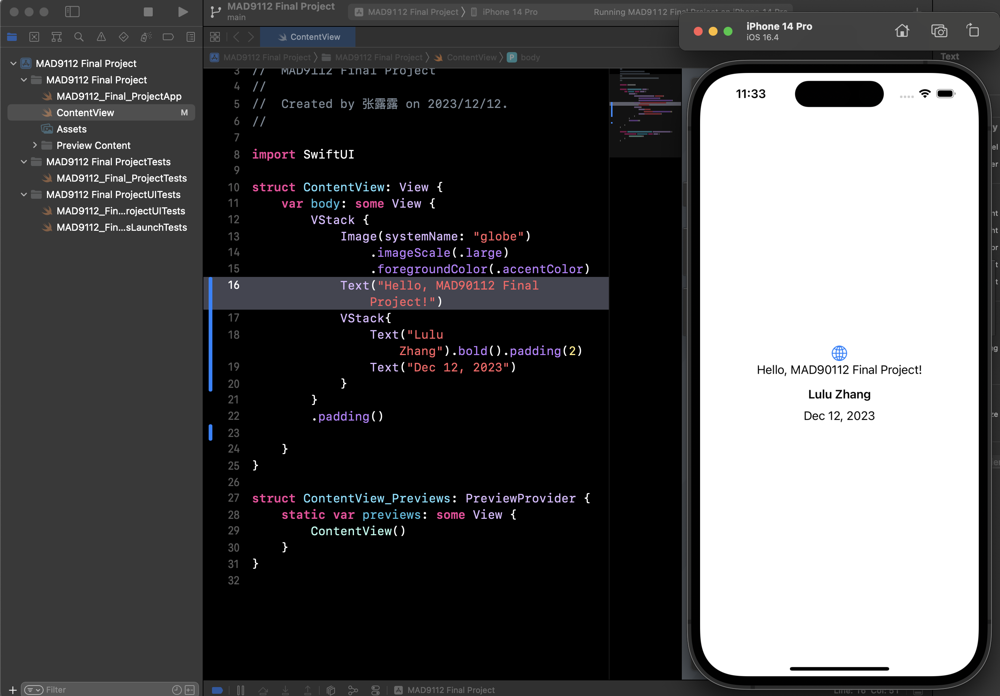
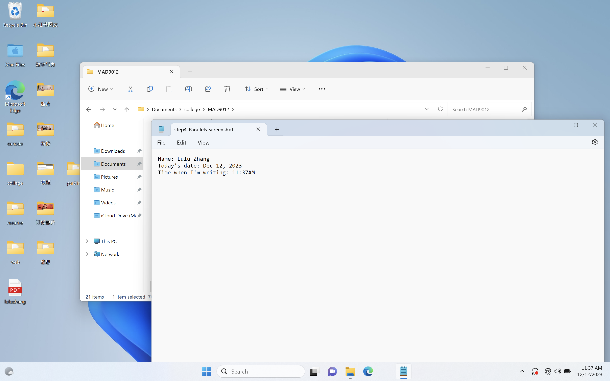

# Lulu_Zhang_FinalProject

## step1

```js
function getDaysUntilChristmas() {

    const today = new Date();
    const christmas = new Date(today.getFullYear(), 11, 25);

    if (today.getMonth() == 11 && today.getDate() > 25) {
        christmas.setFullYear(christmas.getFullYear() + 1);
    }
    const oneDay = 1000 * 60 * 60 * 24; // ms
    return Math.ceil((christmas.getTime() - today.getTime()) / oneDay);
}
console.log(getDaysUntilChristmas());

```

## step2 android screenshots



## step3 ios screenshots


## step4 parallels screenshots
